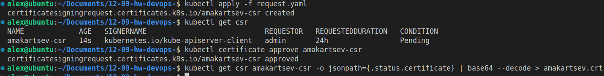

# Домашнее задание к занятию «Управление доступом» "Макарцев Александр Владимирович"

### Цель задания

В тестовой среде Kubernetes нужно предоставить ограниченный доступ пользователю.

------

### Чеклист готовности к домашнему заданию

1. Установлено k8s-решение, например MicroK8S.
2. Установленный локальный kubectl.
3. Редактор YAML-файлов с подключённым github-репозиторием.

------

### Инструменты / дополнительные материалы, которые пригодятся для выполнения задания

1. [Описание](https://kubernetes.io/docs/reference/access-authn-authz/rbac/) RBAC.
2. [Пользователи и авторизация RBAC в Kubernetes](https://habr.com/ru/company/flant/blog/470503/).
3. [RBAC with Kubernetes in Minikube](https://medium.com/@HoussemDellai/rbac-with-kubernetes-in-minikube-4deed658ea7b).

------

### Задание 1. Создайте конфигурацию для подключения пользователя

1. Создайте и подпишите SSL-сертификат для подключения к кластеру.
2. Настройте конфигурационный файл kubectl для подключения.
3. Создайте роли и все необходимые настройки для пользователя.
4. Предусмотрите права пользователя. Пользователь может просматривать логи подов и их конфигурацию (`kubectl logs pod <pod_id>`, `kubectl describe pod <pod_id>`).
5. Предоставьте манифесты и скриншоты и/или вывод необходимых команд.

#### Решение
Манифесты:
- [запрос на подписание сертификата](./request.yaml)
- [роль и привязка к пользователю](./rbac.yaml)
- [Тестовое окружение для проверки](./deploy.yaml)

Генерируем ключ и запрос на выпуск сертификата
```sh
openssl genrsa -out amakartsev.key 4096
```
```sh
openssl req -new -key amakartsev.key -out amakartsev.csr -subj "/CN=amakartsev/O=netology"
```
```sh
cat amakartsev.csr | base64 -w 0 > amakartsev.csr.b64
```

Добавляем csr в манифест и применяем его, под админом подписываем запрос и выгружаем сертификат
```sh
kubectl apply -f request.yaml
```
```sh
kubectl certificate approve amakartsev-csr
```
```sh
kubectl get csr amakartsev-csr -o jsonpath={.status.certificate} | base64 --decode > amakartsev.crt
```


Создаем пользователя и контекст в конфигурацию ```kubectl```
```sh
kubectl config set-credentials amakartsev --client-certificate amakartsev.crt --client-key amakartsev.key --embed-certs=true
```
```sh
kubectl config set-context amakartsev_context --cluster=microk8s-cluster --user=amakartsev
```


Применяет ```rbac```, переключаем контекст и проверяем наши права


------

### Правила приёма работы

1. Домашняя работа оформляется в своём Git-репозитории в файле README.md. Выполненное домашнее задание пришлите ссылкой на .md-файл в вашем репозитории.
2. Файл README.md должен содержать скриншоты вывода необходимых команд `kubectl`, скриншоты результатов.
3. Репозиторий должен содержать тексты манифестов или ссылки на них в файле README.md.

------
